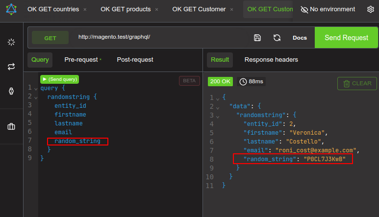
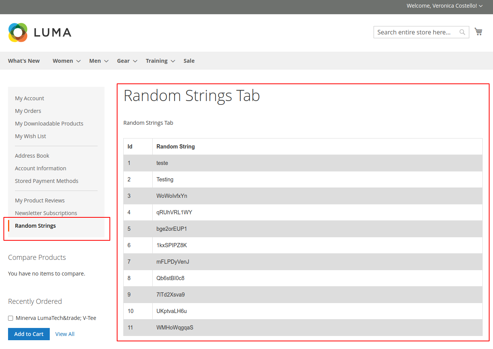
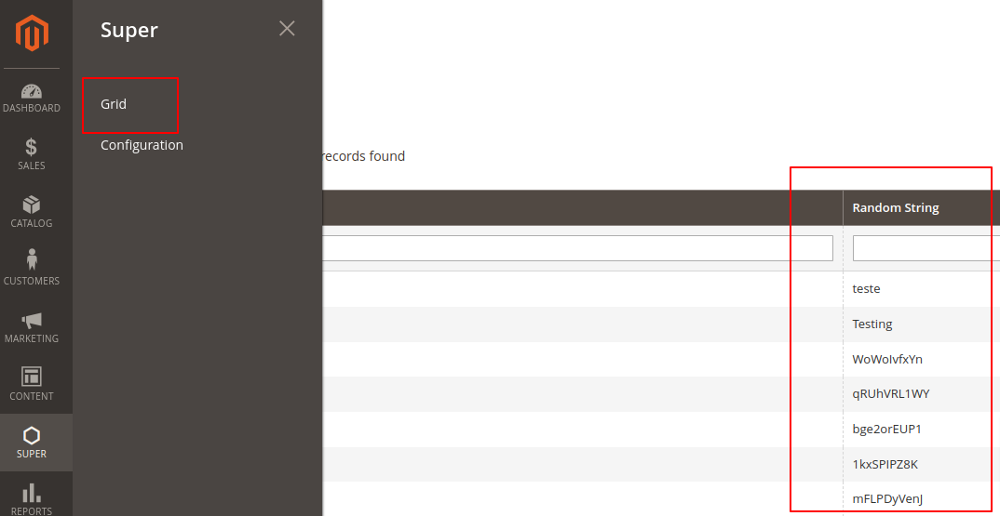
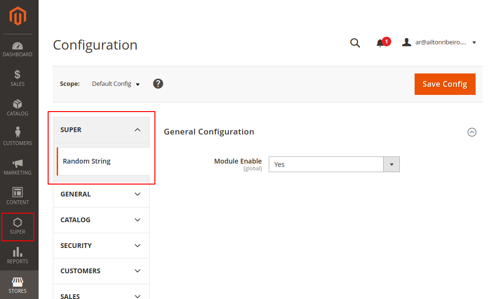

# Random String

## Instalação

Para instalação  do módulo siga os seguintes pasos:

1. clone

```bash
git clone https://github.com/ribahh-4738/RandomString.git
```

2. copiar pasta `Super` para app/code

```bash
cp -r RandomString/Super [instalation_path]/app/code/
```

3. instalar o módulo

```bash
bin/magento module:enable Super_RandomString;
bin/magento setup:upgrade;
```

>  Para maiores informações sobre instalações de módulos no Magento 2, consulte [Enable or disable modules](https://devdocs.magento.com/guides/v2.4/install-gde/install/cli/install-cli-subcommands-enable.html) na documentação oficial.

## GraphQL

Efetue login no **Front-end** como **Customer** , **Sign In** no menu superior ou customer/account/login na URL.

Se no ambiente estiver instalado o sample data , efetue login com as seguintes credenciais:

```bash
# customer
roni_cost@example.com
# pwd
roni_cost3@example.com
```

Se possuir outro usuário **Customer**, efetue login com este, do contrário criar customer - no **Front-end**, em **Create Account** no menu superior ou /customer/account na URL.

Instale o [Altair GraphQL Client](https://chromewebstore.google.com/detail/flnheeellpciglgpaodhkhmapeljopja) se não o tiver instalado e faça a seguinte requisição na URL_DO_MAGENTO/graphql/ método GET para gerar a **random string**

```graphql
query {
  randomstring {
    random_string
  }
}
```

Ou, para ver os dados do usuário logado enquanto gera a **random string**

```graphql
query {
  randomstring {
    entity_id
    firstname
    lastname
    email
    random_string
  }
}
```



## My Account

No **Front-end** com usuário **Customer** logado, em **My Account** selecione  **Random Strings** no menu à esquerda.



## Admin 

No **Admin**, no menu à esquerda, selecione **Super**, **Grid** para visualizar uma listagem das **Random Strings**.



No **Admin**, no menu à esquerda, selecione **Super**, **Confugration** para visualizar um painel de configuração do módulo.



